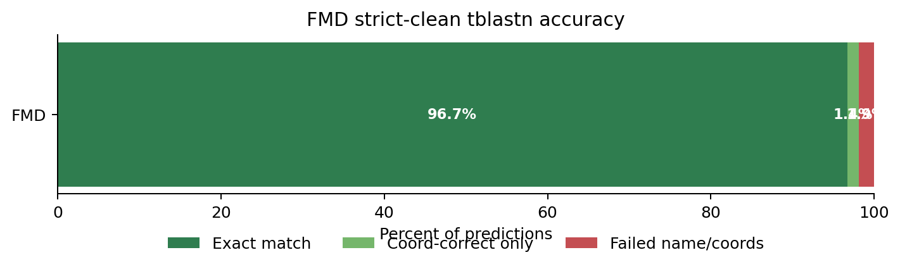

# FMD Validation Report

Report này tóm tắt quá trình validate ViraLift trên FMD strict-clean dataset, từ baseline tblastn lifting ban đầu đến failure breakdown và thử nghiệm cải thiện terminal boundary.

Các notebook/output liên quan:

- `fmd_tblastn_breakdown_strict_clean.ipynb`
- `fmd_terminal_extrapolation_eval.ipynb`
- `outputs_fmd/`
- `terminal_extrapolation_outputs/`

## Executive Summary

FMD validation cho thấy ViraLift đã hoạt động tốt ở mức localization: phần lớn gene được lift đúng vùng trên query genome. Baseline exact match đạt `94.44%`, coordinate-correct đạt `98.18%`.

Sau khi breakdown từng failure, nhiều case không phải do tool lift sai vùng mà do khác biệt giữa reference annotation và query truth annotation. Tuy nhiên, vẫn có một nhóm tool-side boundary error rõ ràng, đặc biệt là các case thiếu terminal amino acids ở đầu/cuối gene.

Để cải thiện, thử nghiệm terminal extrapolation được implement cho nhánh `mat_peptide`/`validate_codons=False`. Logic này dùng HSP query protein coordinates để suy ra nếu alignment thiếu amino acids ở terminal, sau đó extend nucleotide boundary tương ứng.

Kết quả sau thử nghiệm:

- Exact match tăng từ `1088 / 1152 = 94.44%` lên `1114 / 1152 = 96.70%`.
- Tool-side failure giảm từ `36` xuống `9`.
- Các nhóm lỗi `n_terminal_truncation_12bp`, `short_peptide_boundary_offset`, và `minor_c_terminal_truncation_3bp` gần như được xử lý hết.

Kết luận chính: với FMD `mat_peptide`, tblastn lifting đáng tin cậy ở mức định vị gene. Các lỗi còn lại chủ yếu là annotation convention mismatch hoặc một số boundary edge cases nhỏ.

## Validation Goal

Mục tiêu validation không phải chỉ chạy tool trên genome chưa annotate, mà là kiểm tra tool bằng cách:

1. Lấy các query records đã có annotation thật.
2. Giả sử query chưa có annotation.
3. Dùng reference chuẩn để ViraLift/tblastn lift annotation sang query.
4. So sánh output của tool với annotation thật có sẵn trong query.

Cách làm này cho phép đánh giá tool bằng ground truth nội bộ từ GenBank records.

## Dataset And Setup

Validation sử dụng tier `strict_clean` trong:

```text
app/validation/04_tblastn_truth_breakdown_100seq/tiers/strict_clean/
```

Tier `strict_clean` được tạo để giảm noise từ những record có annotation không đủ tốt. Chỉ những record có canonical gene names đầy đủ và có thể so sánh trực tiếp mới được giữ lại làm validation input chính.

Với FMD, pipeline chọn `mat_peptide` làm feature type hữu ích. Điều này quan trọng vì FMD polyprotein thường được annotate thành mature peptides như `VP4`, `VP2`, `VP3`, `VP1`, `2A`, `3A`, `3B`, `3Cpro`, v.v.

## Validation Metrics

Các metric chính:

- `exact_match`: tên gene canonical đúng, start đúng, end đúng.
- `coord_correct`: same-name truth tồn tại và IoU >= 0.90.
- `coord_only`: coordinate-correct nhưng boundary không exact.
- `failed_coord_or_name`: không đạt coordinate correctness hoặc thiếu same-name truth.
- `failure_mode`: phân loại ban đầu như `Boundary offset`, `Wrong coords`, `Not lifted`, `Possible overlap`, `Not in truth`.

Điểm cần lưu ý: `coord_correct` không đủ để kết luận tool hoàn hảo, vì boundary có thể lệch vài bp nhưng IoU vẫn cao. Do đó phần FMD breakdown tập trung vào `non-exact cases`.

## Baseline Result

Baseline là kết quả trước terminal extrapolation.

| Metric | Value |
|---|---:|
| Total predictions | 1152 |
| Exact match | 1088 |
| Exact match % | 94.44% |
| Coordinate-correct | 1131 |
| Coordinate-correct % | 98.18% |
| Coordinate-correct only | 43 |
| Failed coord/name | 21 |
| Failed coord/name % | 1.82% |

Figure:



Baseline interpretation:

- Tool định vị gene rất tốt: `98.18%` coordinate-correct.
- Exact boundary vẫn còn lỗi: `64 / 1152 = 5.56%` non-exact cases.
- Cần breakdown sâu hơn vì non-exact không đồng nghĩa tất cả là lỗi thuật toán.

## Failure Breakdown Method

Mỗi non-exact case được so sánh theo ba nguồn:

1. Reference annotation: feature mà tool đang lift.
2. Prediction: output coordinate của ViraLift.
3. Query truth: annotation thật trong query record.

Các cột quan trọng:

- `ref_len`
- `pred_len`
- `truth_len`
- `pred_minus_ref_len`
- `truth_minus_ref_len`
- `pred_minus_truth_len`
- `delta_start`
- `delta_end`
- `best_overlap_name`
- `failure_mode`

Cách đọc:

- Nếu `pred_len == ref_len` nhưng `truth_len != ref_len`, nhiều khả năng tool đang lift đúng theo reference, còn query truth dùng convention khác.
- Nếu `ref_len == truth_len` nhưng `pred_len` ngắn/dài khác rõ ràng, nhiều khả năng là tool-side boundary issue.
- Nếu `truth_name` không tồn tại, validation không thể score công bằng dù prediction có thể hợp lý về sinh học.

## Baseline Failure Adjudication

Trong `64` non-exact cases baseline:

| Final blame | Cases | Percent of non-exact | Percent of all predictions |
|---|---:|---:|---:|
| Ref/truth annotation artifact | 28 | 43.75% | 2.43% |
| Tool-side issue | 36 | 56.25% | 3.12% |

### Ref/Truth Annotation Artifacts

#### `ref_query_boundary_convention_mismatch`: 25 cases

Tool prediction match reference model, nhưng query truth dùng boundary khác.

Các pattern chính:

- `2A`: reference và prediction thường dài `54 bp`, nhưng query truth annotate `48 bp`.
- `VP1`: một số query truth dài hơn reference vài bp.
- `VP2`: một case query truth dài hơn reference rất nhiều, cho thấy convention khác.

Các case này không nên tính trực tiếp là tool lift sai, vì tool đang làm đúng theo reference được cung cấp.

#### `truth_feature_absent`: 3 cases

Query truth thiếu same-name feature. Prediction có thể overlap vùng sinh học hợp lý, nhưng không có truth cùng tên để so sánh công bằng.

### Tool-Side Issues

Các nhóm lỗi tool-side baseline:

| Cause | Cases | Interpretation |
|---|---:|---|
| `n_terminal_truncation_12bp` | 15 | Thiếu 12 bp ở đầu gene, tương đương 4 aa N-terminal |
| `short_peptide_boundary_offset` | 9 | Offset nhỏ ở peptide ngắn, đặc biệt `2A` |
| `minor_vp1_boundary_offset` | 8 | VP1 lệch boundary nhỏ, IoU vẫn rất cao |
| `minor_c_terminal_truncation_3bp` | 1 | Thiếu 3 bp cuối gene |
| `major_c_terminal_truncation` | 1 | `3A` thiếu 111 bp cuối, lỗi nặng |
| `no_hit` | 1 | Không lift được feature |
| `boundary_offset_matches_neither_ref_nor_truth` | 1 | Boundary lệch, không được ref/truth giải thích |

Insight quan trọng: đa số tool-side issues không phải lift nhầm gene, mà là boundary precision. Nhóm nghiêm trọng thực sự rất ít, nổi bật là `3A` bị thiếu C-terminal 111 bp và một case `2A no_hit`.

Figure:


## Improvement Hypothesis

Quan sát baseline cho thấy nhiều lỗi có dạng:

```text
ref_len == truth_len
pred_len = ref_len - 12 bp
delta_start = +12
delta_end = 0
```

Điều này gợi ý tool bị thiếu `4 aa` ở N-terminal.

Nguyên nhân khả dĩ:

- `tblastn` là local alignment.
- Nếu HSP không cover hết protein query/reference ở đầu hoặc cuối, tool cũ lấy trực tiếp HSP nucleotide span làm full feature boundary.
- Terminal amino acids không align sẽ bị mất khỏi predicted feature.

Ví dụ:

```text
protein_length = 201 aa
HSP query_start = 5
missing N-terminal = 5 - 1 = 4 aa
missing nucleotide = 4 * 3 = 12 bp
```

Thay vì hard-code `12 bp`, tool có thể tính phần thiếu từ HSP query protein coordinates.

## Terminal Extrapolation Experiment

Experiment được ghi lại trong:

```text
fmd_terminal_extrapolation_eval.ipynb
```

Logic mới được implement trong:

```text
app/src/lifting/tblastn_lifter.py
```

Ý tưởng:

- Dùng `query_start/query_end` của HSP trên protein reference để biết HSP cover từ amino acid nào đến amino acid nào.
- Nếu HSP không bắt đầu từ aa 1, extend N-terminal.
- Nếu HSP không kết thúc ở `protein_length`, extend C-terminal.
- Extension = số amino acids thiếu * 3 bp.

Guardrails:

- Chỉ áp dụng cho path `validate_codons=False`.
- Trong validation hiện tại, FMD `mat_peptide` đi qua path này.
- CDS/PRRSV path không bị ảnh hưởng vì dùng `validate_codons=True`.
- Chỉ extrapolate nếu coverage đủ cao.
- Missing terminal amino acids phải nhỏ.
- Không vượt genome boundary.

Điểm quan trọng:

```text
mat_peptide -> validate_codons=False -> có thể trigger terminal extrapolation
CDS         -> validate_codons=True  -> không trigger terminal extrapolation
```

Vì vậy đây không phải hard-code cho FMD theo tên virus. Logic trigger theo feature/lifting path.

## Experiment Result

So sánh baseline với terminal extrapolation:

| Run | Total | Exact match | Coordinate-correct | Coord-only | Failed coord/name | Exact % | Coord % | Failed % |
|---|---:|---:|---:|---:|---:|---:|---:|---:|
| Baseline | 1152 | 1088 | 1131 | 43 | 21 | 94.44% | 98.18% | 1.82% |
| Terminal extrapolation | 1152 | 1114 | 1130 | 16 | 22 | 96.70% | 98.09% | 1.91% |

Figure:


Interpretation:

- Exact match tăng `+26 cases`.
- Coordinate-correct giảm nhẹ `-1 case`.
- Coord-only giảm mạnh từ `43` xuống `16`, tức nhiều boundary-offset cases trở thành exact.
- Failed coord/name tăng nhẹ `+1`, nhưng mức tăng nhỏ so với số exact boundary được sửa.

## Failure Cause Changes

| Cause | Baseline | Terminal extrapolation | Delta |
|---|---:|---:|---:|
| `n_terminal_truncation_12bp` | 15 | 0 | -15 |
| `short_peptide_boundary_offset` | 9 | 0 | -9 |
| `minor_c_terminal_truncation_3bp` | 1 | 0 | -1 |
| `boundary_offset_matches_neither_ref_nor_truth` | 1 | 0 | -1 |
| `minor_vp1_boundary_offset` | 8 | 7 | -1 |
| `major_c_terminal_truncation` | 1 | 1 | 0 |
| `no_hit` | 1 | 1 | 0 |
| `truth_feature_absent` | 3 | 3 | 0 |
| `ref_query_boundary_convention_mismatch` | 25 | 26 | +1 |

Tool-side failures:

| Run | Tool-side cases |
|---|---:|
| Baseline | 36 |
| Terminal extrapolation | 9 |

This is the main improvement: terminal extrapolation reduced tool-side boundary failures by `27 cases`.

## Final FMD Status After Improvement

Current FMD breakdown after terminal extrapolation:

| Final blame | Cases | Percent of failures | Percent of all predictions |
|---|---:|---:|---:|
| Ref/truth artifact | 29 | 76.32% | 2.52% |
| Tool-side issue | 9 | 23.68% | 0.78% |

Interpretation:

- Sau cải thiện, phần lớn non-exact cases còn lại không phải lỗi tool trực tiếp mà là ref/query truth convention hoặc truth feature absent.
- Tool-side issue còn lại chỉ chiếm `0.78%` toàn bộ FMD predictions.
- FMD localization vẫn rất mạnh, và exact boundary precision đã cải thiện rõ.

## Remaining Cases

Các nhóm còn lại cần chú ý:

### `minor_vp1_boundary_offset`: 7 cases

Một số VP1 vẫn lệch boundary nhỏ, thường `delta_end = -6`. Ví dụ `AY687334.1 - VP1`:

```text
ref_len   = 633
truth_len = 633
pred_len  = 627
delta_start = 0
delta_end   = -6
status = ok
```

Case này không trigger terminal extrapolation vì HSP không báo thiếu terminal amino acid; coverage vẫn là `1.0`. Vì vậy logic mới không biết cần extend thêm 6 bp.

Đây là residual boundary case. Muốn sửa tiếp có thể cần một bước khác, ví dụ `ref-length reconciliation`, không phải HSP terminal extrapolation.

### `major_c_terminal_truncation`: 1 case

Case `3A` bị thiếu `111 bp` cuối. Đây là tool-side error rõ hơn và chưa được terminal extrapolation sửa. Do missing quá lớn hoặc alignment không đủ chắc, không nên tự extend bằng rule conservative hiện tại.

### `no_hit`: 1 case

Một feature `2A` không lift được. Đây là miss rõ, cần debug riêng.

### Ref/truth artifacts

Một số case như `2A`, `VP1`, `VP2` còn non-exact vì reference và query truth dùng boundary convention khác. Đây không nên được dùng để kết luận tool sai trực tiếp.

## Conclusion

FMD validation cho thấy ViraLift/tblastn lifting đáng tin cậy cho `mat_peptide` annotation transfer.

Baseline đã đạt:

- Exact match: `94.44%`
- Coordinate-correct: `98.18%`

Sau terminal extrapolation:

- Exact match tăng lên `96.70%`
- Tool-side failures giảm từ `36` xuống `9`
- Các lỗi thiếu terminal amino acids được xử lý hiệu quả

Kết luận thực tế:

> ViraLift performs highly reliable FMD mat_peptide localization. Most remaining non-exact cases after terminal extrapolation are caused by reference/query annotation convention differences rather than clear tool-side localization failures.

## Suggested Next Steps

1. Giữ terminal extrapolation cho `mat_peptide` path.
2. Không mở rộng ngay sang CDS/PRRSV trước khi có validation riêng, vì PRRSV có overlapping genes và frameshift boundary phức tạp.
3. Điều tra riêng các residual VP1 boundary offsets.
4. Thử một branch mới cho `ref-length reconciliation` nếu muốn sửa các case như `AY687334.1 - VP1`.
5. Debug case `3A major_c_terminal_truncation` và `2A no_hit` riêng.
6. Chuẩn bị vài case representative để so sánh với GATU hoặc manual annotation review.

