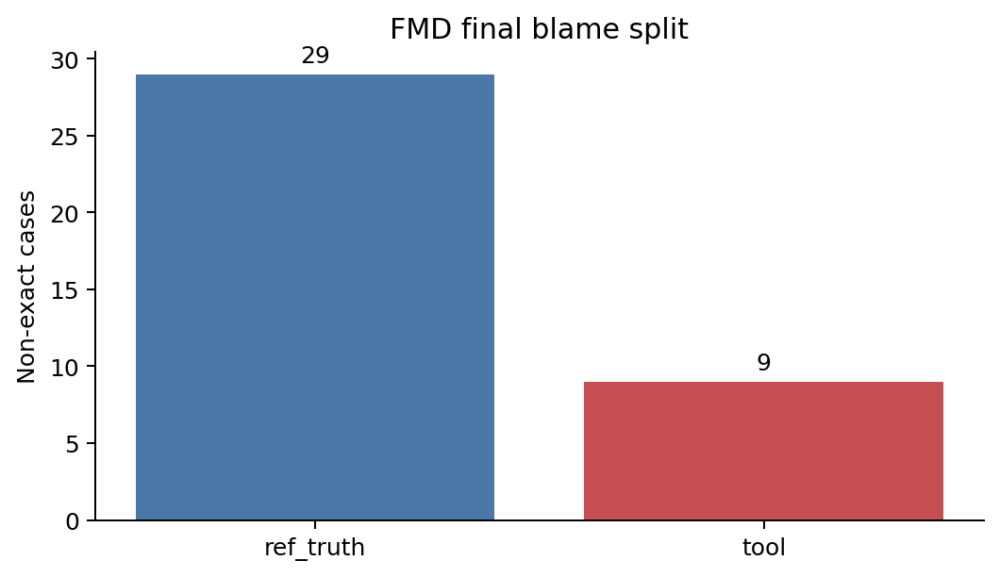
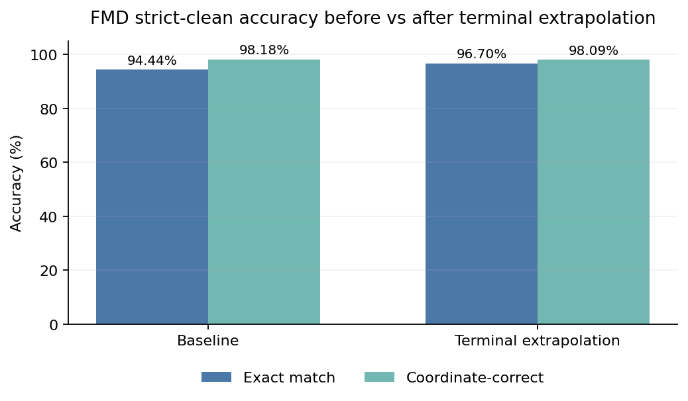
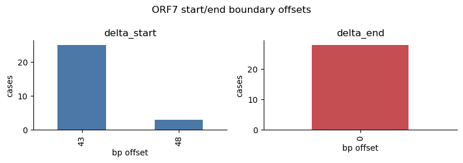

# ViraLift: Tổng Quan Tool Và Báo Cáo Validation

## Mục Lục

- [1. ViraLift Là Gì?](#viralift-la-gi)
- [2. Tool Chạy Như Thế Nào?](#tool-chay-nhu-the-nao)
- [3. Ví Dụ Sử Dụng](#vi-du-su-dung)
- [4. Validation Dataset](#validation-dataset)
- [5. Cách Tính Accuracy](#cach-tinh-accuracy)
- [6. Kết Quả Tổng Quan](#ket-qua-tong-quan)
- [7. Breakdown Theo Gene: FMD](#breakdown-fmd)
- [8. Breakdown Theo Gene: PRRSV](#breakdown-prrsv)
- [9. Finding Chính](#finding-chinh)
- [10. Kết Luận](#ket-luan)

<a id="viralift-la-gi"></a>

## 1. ViraLift Là Gì?

ViraLift là tool hỗ trợ chuẩn hóa và chuyển annotation gene/peptide cho virus genome.

Mục tiêu chính:

- Chuẩn hóa tên gene từ nhiều cách đặt tên khác nhau trong GenBank.
- Nếu query genome đã có annotation đủ tốt, tool trích xuất trực tiếp từ annotation.
- Nếu query genome chưa có annotation hoặc annotation thiếu, tool dùng reference chuẩn do user cung cấp để lift gene bằng `tblastn`.
- Xuất kết quả thành bảng TSV và FASTA để user kiểm tra hoặc dùng tiếp.

Tool hiện được validate chính trên 2 nhóm virus:

- FMDV: dùng `mat_peptide`, gene/peptide thường liên tiếp.
- PRRSV: dùng `CDS`/ORF, có nhiều gene chồng lấp và convention annotation phức tạp hơn.

<a id="tool-chay-nhu-the-nao"></a>

## 2. Tool Chạy Như Thế Nào?

Pipeline chính:

1. User cung cấp reference GenBank đã annotation chuẩn.
2. Tool đọc reference và xác định feature type hữu ích, ví dụ `CDS` hoặc `mat_peptide`.
3. Tool chuẩn hóa tên gene bằng alias map.
4. Với mỗi query genome:
   - Nếu query có annotation đủ hữu ích, tool direct extract.
   - Nếu query thiếu annotation, tool dùng `tblastn` để map protein từ reference sang genome query.
5. Tool validate boundary:
   - Với `CDS`: kiểm tra start/stop codon và frame.
   - Với `mat_peptide`: không dùng start/stop codon vì peptide cleavage product không nhất thiết có ATG/stop riêng.
6. Tool xuất:
   - bảng prediction,
   - FASTA sequence,
   - run summary,
   - status cho từng gene.

Với `tblastn` lifting:

- Reference feature được dịch sang protein.
- Protein được search trên query genome bằng `tblastn`.
- HSPs được merge để suy ra tọa độ nucleotide.
- Tool chỉnh boundary nếu cần, ví dụ terminal extrapolation cho FMD hoặc start-codon rescue cho PRRSV.

`HSP` là một đoạn alignment tốt do BLAST trả về. Một gene có thể có một hoặc nhiều HSP. ViraLift dùng các HSP này để suy ra vùng nucleotide tương ứng trên query genome.

<a id="vi-du-su-dung"></a>

## 3. Ví Dụ Sử Dụng

Ví dụ chạy bằng CLI:

```bash
python -m app.src.main \
  --reference app/data/PRRS_ref_test.gb \
  --query app/data/PRRS_PP946131_noAnno.gb \
  --output output/prrs_example
```

Ví dụ logic kết quả:

```text
ORF5  -> lifted bằng tblastn, tọa độ đúng, status ok
ORF7  -> lifted bằng tblastn, start được rescue, status ok_rescued
ORF2b -> lifted đúng nhưng một số query truth có thể không annotate ORF2b riêng
```

Ý nghĩa status thường gặp:

- `ok`: lift thành công, boundary hợp lệ.
- `ok_rescued`: boundary ban đầu chưa ổn, tool đã rescue lại.
- `ok_extrapolated`: boundary được mở rộng bằng terminal extrapolation.
- `no_hit`: không tìm được hit phù hợp.
- `invalid_boundaries`: tìm được vùng nhưng boundary/codon validation chưa đạt.

Với `CDS`, `invalid_boundaries` có thể xảy ra nếu thiếu start codon, thiếu stop codon, hoặc CDS length không chia hết cho 3 (`in_frame = false`).

<a id="validation-dataset"></a>

## 4. Validation Dataset

Validation dùng 2 bộ virus annotated records:

- FMDV strict-clean records.
- PRRSV strict-clean records.

Nguyên tắc lọc strict-clean:

- Chỉ giữ record có annotation đủ để làm ground truth.
- Tên gene phải map được về canonical name qua alias map.
- Với PRRSV, không dùng nested-feature filter mù vì `ORF2b` có thể overlap/nest trong `ORF2a` nhưng vẫn là gene thật.
- Với các gene không xuất hiện trong truth của một query record, không dùng record đó để chấm accuracy cho gene đó.

Ví dụ:

- Reference có `ORF7`.
- Trong 95 PRRSV records, truth có `ORF7` ở 94 records.
- Vậy accuracy của `ORF7` chỉ tính trên 94 records đó.

Điều này giúp tránh đánh giá sai tool vì annotation truth thiếu hoặc dùng convention khác.

<a id="cach-tinh-accuracy"></a>

## 5. Cách Tính Accuracy

Validation được tính theo từng gene.

Các metric chính:

- `total`: số query records thật sự có gene đó trong truth.
- `exact`: prediction khớp hoàn toàn tên gene + start + end.
- `coord_only`: tọa độ đúng theo IoU threshold nhưng không exact tuyệt đối.
- `failed`: không exact và cũng không coordinate-correct.
- `accuracy_pct = (exact + coord_only) / total`.
- `IoU`: chỉ số đo mức overlap giữa tọa độ prediction và tọa độ truth.

### IoU Là Gì?

`IoU` là viết tắt của `Intersection over Union`.

Nói đơn giản:

```text
IoU = độ dài phần prediction và truth chồng lên nhau
      / độ dài vùng bao phủ bởi cả prediction và truth
```

Ví dụ 1: prediction khớp hoàn toàn truth

```text
Truth:      100 - 199
Prediction: 100 - 199
IoU = 100 / 100 = 1.00
```

Ví dụ 2: prediction lệch một chút nhưng vẫn gần đúng

```text
Truth:      100 - 199
Prediction: 103 - 199
Overlap = 97 bp
Union = 100 bp
IoU = 0.97
```

Ví dụ 3: prediction lệch nhiều hơn

```text
Truth:      100 - 199
Prediction: 130 - 199
Overlap = 70 bp
Union = 100 bp
IoU = 0.70
```

Trong validation này, một prediction được tính là `coord_correct` nếu:

```text
same-gene truth tồn tại
và IoU >= 0.90
```

Vì vậy:

- `IoU = 1.00`: tọa độ khớp hoàn toàn.
- `IoU >= 0.90`: tọa độ đủ gần, tính là coordinate-correct.
- `IoU < 0.90`: tính là failed về tọa độ.

Lưu ý quan trọng:

- Với gene dài, lệch vài bp thường IoU vẫn cao.
- Với gene rất ngắn như FMD `2A`, chỉ lệch `6 bp` cũng có thể làm IoU tụt dưới `0.90`.
- Vì vậy một số failed cases ở gene ngắn không nhất thiết là lift sai vùng lớn, mà là boundary precision bị strict scoring phạt mạnh.

Ví dụ:

```text
ORF7 total = 94
exact = 91
coord_only = 0
failed = 3
accuracy = 91 / 94 = 96.81%
```

Lý do tách `exact` và `coord_only`:

- `exact` đo boundary precision rất nghiêm ngặt.
- `coord_only` cho biết tool đã tìm đúng vùng gene, dù start/end lệch nhỏ hoặc annotation convention khác.
- Với virus annotation, nhiều case lệch vài bp có thể do convention, không nhất thiết là localization failure.

<a id="ket-qua-tong-quan"></a>

## 6. Kết Quả Tổng Quan

Kết quả sau các cải thiện hiện tại:


| Virus | Total gene-record cases | Exact | Coord only | Failed | Accuracy |
|---|---:|---:|---:|---:|---:|
| FMD | 1149 | 1114 | 16 | 19 | 98.35% |
| PRRSV | 761 | 674 | 84 | 3 | 99.61% |
| All | 1910 | 1788 | 100 | 22 | 98.85% |

Diễn giải:

- FMD đạt `98.35%` khi tính exact + coordinate-correct.
- PRRSV đạt `99.61%` khi tính trên các gene thật sự có trong truth.
- Phần lớn lỗi còn lại là boundary issue nhỏ hoặc annotation/ref-truth mismatch.

Figure dưới đây breakdown theo từng gene. Màu xanh đậm là exact, xanh nhạt là coord-only, đỏ là failed.


<a id="breakdown-fmd"></a>

## 7. Breakdown Theo Gene: FMD

FMD có 12 peptide (`mat_peptide`). Phần này đi theo mạch: xem từng peptide ra sao ở baseline → khoanh vùng cái fail nhiều → tìm lỗi → cải thiện → kết quả sau.

### Bước 1 — Baseline: bức tranh từng peptide

Chạy tblastn với code gốc, exact đạt `94.44%` (1088/1152). Đa số peptide đã gần như hoàn hảo; lỗi chỉ dồn vào vài chỗ:

- Sạch (~100%): `VP4`, `VP2`, `VP3`, `2B`, `2C`, `3A`, `3B`, `3Cpro`, `3Dpol`.
- Lệch boundary nhẹ: `VP1` (coord đúng, boundary lệch theo convention).
- Fail nhiều → cần đào sâu: `Lpro` (HSP cụt 12 bp đầu N-terminal, 14 ca lệch start) và `2A` (peptide siêu ngắn, lệch vài bp đủ làm IoU < 0.90).

Khoanh vùng: 9/12 peptide đã sạch. `Lpro` là lỗi tool thật sự (truncation N-terminal) nên đáng cải thiện; `2A` chủ yếu là scoring artifact của gene ngắn.

### Bước 2 — Finding: tblastn align cụt vài amino acid ở terminal

Gom lỗi tool-side theo cơ chế (đã loại các case do ref/truth convention):

| Cơ chế lỗi tool (baseline) | Ca | Gene chính |
|---|---:|---|
| n_terminal_truncation_12bp | 15 | Lpro — thiếu 4 aa (12 bp) đầu N-terminal |
| short_peptide_boundary_offset | 9 | peptide ngắn lệch boundary vài bp |
| minor_vp1_boundary_offset | 8 | VP1 — lệch nhẹ (convention) |
| minor_c_terminal_truncation_3bp | 1 | thiếu 1 aa ở C-terminal |

Vì sao không rescue bằng codon được: `mat_peptide` là cleavage product nên không có start/stop codon riêng. Khi tblastn align cụt vài residue ở đầu/cuối, không thể tìm ATG/stop để rescue như CDS → cần cơ chế khác.



### Bước 3 — Cải thiện: terminal extrapolation

Dùng tọa độ query protein trong HSP để biết phần amino acid bị cụt, rồi mở rộng boundary tới đúng đầu/cuối peptide. Chỉ áp dụng khi lượng thiếu nhỏ; case được mở rộng gắn status `ok_extrapolated`.

### Bước 4 — Kết quả sau cải thiện

- Raw FMD exact tăng từ `94.44%` lên `96.70%`; 26 case fixed, 0 regress.
- `n_terminal_truncation_12bp` (Lpro): 15 → 0. `short_peptide_boundary_offset`: 9 → 0.
- Final per-gene truth-available: FMD exact `96.95%`, coordinate-correct `98.35%`.



Bảng per-gene cuối:

| Gene | Total | Exact | Coord only | Failed | Accuracy |
|---|---:|---:|---:|---:|---:|
| Lpro | 96 | 96 | 0 | 0 | 100.00% |
| VP4 | 95 | 95 | 0 | 0 | 100.00% |
| VP2 | 96 | 95 | 0 | 1 | 98.96% |
| VP3 | 95 | 95 | 0 | 0 | 100.00% |
| VP1 | 95 | 79 | 16 | 0 | 100.00% |
| 2A | 96 | 79 | 0 | 17 | 82.29% |
| 2B | 96 | 96 | 0 | 0 | 100.00% |
| 2C | 96 | 96 | 0 | 0 | 100.00% |
| 3A | 96 | 95 | 0 | 1 | 98.96% |
| 3B | 96 | 96 | 0 | 0 | 100.00% |
| 3Cpro | 96 | 96 | 0 | 0 | 100.00% |
| 3Dpol | 96 | 96 | 0 | 0 | 100.00% |

Lỗi còn lại đều không còn là truncation tool:

- `VP1`: 16 coord-only — đúng vùng, boundary lệch theo convention.
- `2A`: gene siêu ngắn, lệch vài bp = IoU < 0.90 → bị strict scoring phạt, không phải lift sai vùng.
- `VP2`, `3A`: mỗi gene 1 ca, cần manual review.

<a id="breakdown-prrsv"></a>

## 8. Breakdown Theo Gene: PRRSV

PRRSV có 9 ORF (`CDS`), một số overlap nhau (`ORF2a/ORF2b`). Cùng mạch: xem từng ORF ra sao → tìm ORF fail bất thường → đào sâu → cải thiện → kết quả sau.

### Bước 1 — Baseline: bức tranh từng ORF (exact / total)

Per-gene exact ở baseline (tính trên records có same-gene trong truth):

| Gene | Exact / Total (baseline) | Trạng thái | Ghi chú |
|---|---:|---|---|
| ORF2a | 95 / 95 | Sạch | — |
| ORF3 | 95 / 95 | Sạch | — |
| ORF1a | 61 / 62 | Sạch | 1 ca do granularity ORF1ab |
| ORF4 | 94 / 95 | Lệch nhẹ | boundary offset vài bp |
| ORF2b | 45 / 48 | Lệch nhẹ | boundary offset |
| ORF5 | 91 / 95 | Lệch nhẹ | boundary offset |
| ORF6 | 91 / 94 | Lệch nhẹ | boundary offset |
| ORF1b | 0 / 83 | Convention | coord đúng 83/83, start lệch do frameshift → không phải bug |
| ORF7 | 66 / 94 | Fail nhiều | tệ hơn hẳn các ORF khác → đào sâu |

Khoanh vùng: phần lớn ORF đã đúng hoặc chỉ lệch boundary nhẹ. `ORF1b` 0 exact nhưng là convention (coord đúng hết). Riêng `ORF7` fail tới 28/94 — bất thường → tách riêng investigate. Tổng exact baseline ≈ 638.

### Bước 2 — Finding: ORF7 start rescue chọn nhầm internal ATG

So delta tọa độ prediction vs truth cho riêng ORF7 → một pattern lặp lại rất rõ: `delta_end = 0` nhưng `delta_start = +43 / +48`. Tool tìm đúng điểm kết thúc, nhưng start lại nhảy vào một ATG nội bộ bên trong thay vì ATG upstream thật → CDS bị ngắn lại.



### Bước 3 — Cải thiện: frame & ref-length-aware start rescue

Thay vì chọn ATG gần nhất một cách mù, start rescue giờ:

- kiểm tra frame: `len(CDS) % 3 == 0`;
- ưu tiên ATG tạo CDS đúng frame và có độ dài gần reference → bỏ qua các internal ATG tạo CDS quá ngắn.

### Bước 4 — Kết quả sau cải thiện

- `ORF7`: 66 → 91.
- Các ORF lệch nhẹ cũng về 100%: `ORF5` 91→95, `ORF6` 91→94, `ORF2b` 45→48, `ORF4` 94→95.


Bảng per-gene cuối:

| Gene | Total | Exact | Coord only | Failed | Accuracy |
|---|---:|---:|---:|---:|---:|
| ORF1a | 62 | 61 | 1 | 0 | 100.00% |
| ORF1b | 83 | 0 | 83 | 0 | 100.00% |
| ORF2a | 95 | 95 | 0 | 0 | 100.00% |
| ORF2b | 48 | 48 | 0 | 0 | 100.00% |
| ORF3 | 95 | 95 | 0 | 0 | 100.00% |
| ORF4 | 95 | 95 | 0 | 0 | 100.00% |
| ORF5 | 95 | 95 | 0 | 0 | 100.00% |
| ORF6 | 94 | 94 | 0 | 0 | 100.00% |
| ORF7 | 94 | 91 | 0 | 3 | 96.81% |

3 case `ORF7` còn lại cố ý không auto-fix: cả 3 có `truth_len = 387 bp` trong khi reference ORF7 chỉ `372 bp`. Ref-length rescue cố ý không kéo dài vượt reference, nên để lại cho manual review / annotation convention.

ORF7-only experiment xác nhận đúng cơ chế lỗi: fix đúng 25 ca ref/truth cùng 372 bp, còn lại 3 ca truth dài hơn.


<a id="finding-chinh"></a>

## 9. Finding Chính

Các finding quan trọng:

1. Accuracy phải tính trên gene thật sự có trong truth.
   - Nếu query truth không annotate gene đó, không thể dùng case đó để kết luận tool sai.

2. FMD và PRRSV cần xử lý khác nhau.
   - FMD dùng `mat_peptide`: phù hợp với terminal extrapolation.
   - PRRSV dùng `CDS`: phù hợp với codon/frame-aware rescue.

3. `tblastn` thường tìm đúng vùng gene.
   - Lỗi chính không phải search sai vùng lớn.
   - Lỗi thường nằm ở boundary start/end.

4. ORF1b PRRSV cần interpretation riêng.
   - Coord đúng `83/83`.
   - Exact fail do frameshift/start-boundary convention.

5. Gene ngắn như FMD `2A` dễ bị IoU phạt mạnh.
   - Lệch `6 bp` ở gene rất ngắn có thể làm IoU dưới `0.90`.

<a id="ket-luan"></a>

## 10. Kết Luận

ViraLift cho kết quả tốt trên cả FMD và PRRSV khi validation được tính đúng theo same-gene truth availability.

Kết quả cuối:

- FMD: `98.35%`
- PRRSV: `99.61%`
- Tổng 2 tập: `98.85%`

Kết luận kỹ thuật:

- `tblastn` là hướng phù hợp cho annotation transfer khi query thiếu annotation.
- Các lỗi còn lại chủ yếu là boundary precision hoặc annotation convention mismatch.
- Terminal extrapolation cải thiện FMD.
- Frame/ref-length-aware start rescue cải thiện PRRSV, đặc biệt ORF7.

Một câu tóm tắt:

> ViraLift reliably transfers viral gene annotations using reference-guided tblastn lifting. On strict-clean FMDV and PRRSV validation datasets, the tool achieves high localization accuracy, with remaining failures mostly caused by short-feature boundary sensitivity or reference/query annotation convention differences.
