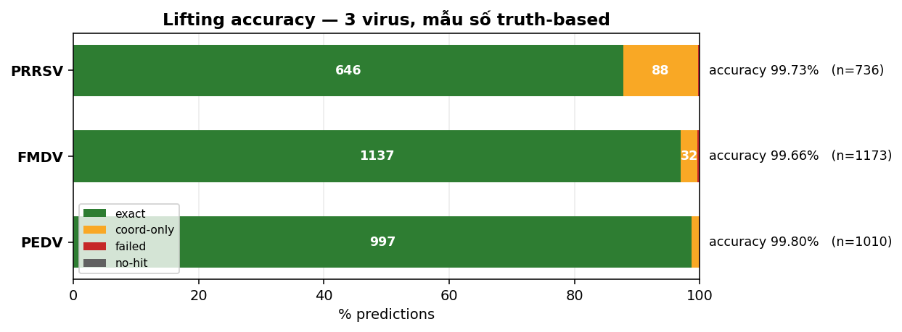
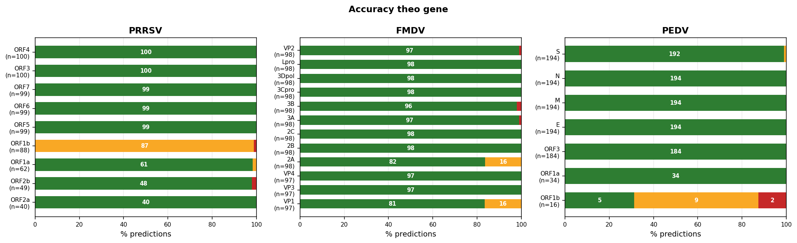
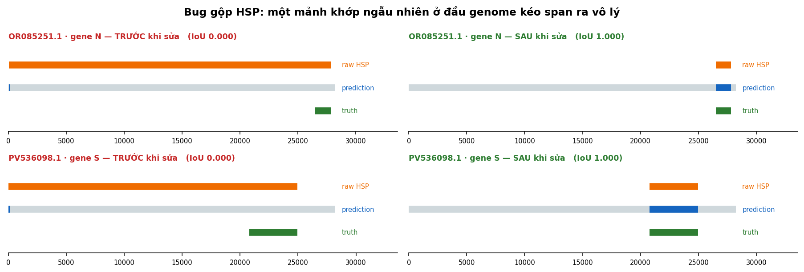
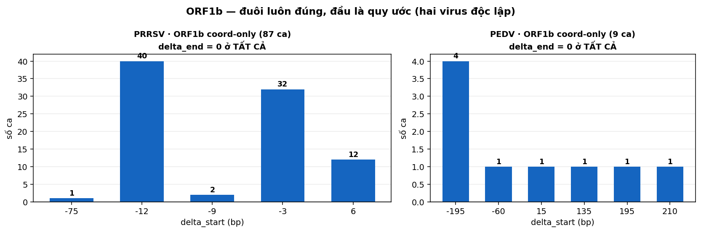
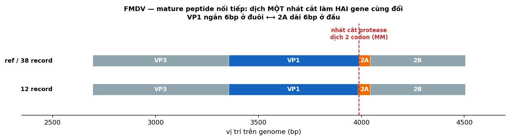

# Validation lifting accuracy — PRRSV, FMDV, PEDV

Tài liệu tổng hợp kết quả validation của bước lifting/annotation trong ViraLift, chạy trên ba virus có
cấu trúc genome khác nhau. Nguồn số liệu: `app/validation/02_lifting_accuracy/{prrsv,fmdv,pedv}_accuracy.ipynb`.

## Tóm tắt

Trên **2917 prediction** (300 record, ba virus, PEDV chạy với hai reference), accuracy đạt **99.79%** —
2780 exact, 131 coord-only, 6 failed, 0 no-hit. Sau khi sửa các lỗi mà validation phát hiện, chỉ còn
**1/2917 ca** được quy trách nhiệm cho tool.

Validation tìm ra **bốn lỗi tool thật** và đã sửa hết. Phần dư gần như toàn bộ không phải lỗi lifting mà
là **sự bất nhất trong annotation của chính GenBank** — đúng thứ tool sinh ra để giải quyết.

## Thiết kế validation

Mẫu số theo **truth-based**: với mỗi gene, mẫu số là số record thực sự có gene đó trong annotation gốc
(khớp theo `ref_name` sau chuẩn hóa alias). Cách này tránh phạt tool vì những gene mà record vốn không khai.

Mỗi prediction rơi vào một trong bốn nhóm. **exact** khi cả hai biên trùng khít truth. **coord-only** khi
không exact nhưng `IoU ≥ 0.90` (hoặc cả hai biên lệch trong `bp_tolerance = 6bp`) và codon hợp lệ.
**failed** khi có trong truth nhưng không đạt coord-correct. **no-hit** khi tblastn không ra hit.
`accuracy = (exact + coord-only) / tổng`.

Các prediction không có truth đối ứng được tách riêng sang `extra_predictions_without_truth` thay vì tính
là sai — đây là các ca name-gap/granularity, bàn ở mục dưới.

Nguyên tắc xuyên suốt khi sửa lỗi: **leakage-free** (chỉ dùng reference protein và tọa độ alignment, không
bao giờ dùng truth annotation) và **generic** (không rẽ nhánh theo tên virus hay tên gene).

## Kết quả



| | PRRSV | FMDV | PEDV | Tổng |
|---|---|---|---|---|
| prediction | 736 | 1171 | 1010 | 2917 |
| exact | 646 (87.77%) | 1137 (97.10%) | 997 (98.71%) | 2780 |
| coord-only | 88 | 32 | 11 | 131 |
| failed | 2 | 2 | 2 | 6 |
| no-hit | 0 | 0 | 0 | 0 |
| **accuracy** | **99.73%** | **99.83%** | **99.80%** | **99.79%** |
| blame `tool` | 0 | 1 | 0 | 1 |

> **Ghi chú số FMDV:** accuracy 99.66% → 99.83% (failed 4→2) đến từ việc **tách `3B1/3B2/3B3` khỏi `3B`**
> trong config. Đây là **sửa metric/naming**, KHÔNG phải lifting cải thiện: ref gộp VPg thành một cụm 213bp,
> vài record tách 3 bản ~72bp; để chúng làm alias của 3B ép so 213bp với 72bp (IoU 0.34) → failed oan. Tách
> canonical loại bỏ so sánh khập khiễng đó. Prediction tọa độ không đổi. Cùng bản chất với ORF1ab vs
> ORF1a/ORF1b và bp-tolerance.

Ba virus có cấu trúc rất khác nhau nhưng accuracy hội tụ quanh 99.7%. Điều đáng chú ý hơn là `exact_pct`
lại chênh nhau nhiều (87.8% / 96.9% / 98.7%) — chênh lệch đó gần như hoàn toàn đến từ **một gene duy nhất
ở PRRSV**, xem mục ORF1b bên dưới.



PEDV chạy với hai reference dùng hai quy ước annotation khác nhau; kết quả trong bảng là gộp cả hai.

## Bốn lỗi tool đã tìm ra và sửa

### ORF7 — neo nhầm start codon nội bộ (PRRSV, ~29 record)

Reference ORF7 có một ATG nội bộ ở Met25, tức cách đầu thật **+72bp**. Với một clade có N-terminus phân kỳ,
tblastn hụt khoảng 24 axit amin đầu (coverage 0.86), khiến cơ chế start-rescue neo vào ATG nội bộ đó thay vì
đầu thật.

Sửa bằng cách nới anchor ngược lên theo **số aa N-terminal của reference chưa align được** — một đại lượng
đo được từ chính alignment, không cần biết truth. Đồng thời quét từ offset 0 và dùng raw HSP end thay vì end
đã rescue. Kết quả `delta_start +72 → 0`, IoU `0.69 → >0.99`, chuyển thành exact.

### ORF1a — đọc lố qua stop codon (PRRSV, ~40 record)

Tool bám theo độ dài reference nên đọc xuyên qua stop codon in-frame đầu tiên, tạo ra CDS chứa stop nội bộ —
một CDS không hợp lệ về mặt sinh học. Ở một số record nó đọc qua tới bốn stop codon liên tiếp.

Sửa bằng cách trim đuôi về stop in-frame đầu tiên. `delta_end +15/+66 → 0`, exact.

### Validator không phát hiện stop codon nội bộ

Lỗi nền của ca trên: `validate_cds_boundaries` không kiểm tra stop nội bộ nên coi CDS hỏng là hợp lệ. Đã bổ
sung `has_internal_stop`, và `valid` giờ yêu cầu không có stop nội bộ.

### Gộp HSP không kiểm tra khoảng cách (PEDV, 2 record × 2 reference)

Đây là lỗi nghiêm trọng nhất và khó thấy nhất.

tblastn là local aligner nên một gene thường ra **nhiều mảnh khớp (HSP)**, do alignment đứt ở mỗi chỗ có
indel hoặc đoạn phân kỳ. `merge_hsps` khâu chúng lại bằng `min(start)` và `max(end)` trên mọi mảnh cùng
chiều — tức lấy **bao lồi**, ngầm giả định mọi mảnh đều thuộc về gene đó.

Nhưng BLAST cũng trả về những mảnh yếu, trùng hợp ngẫu nhiên. Một protein 442aa quét qua 28kb trong sáu
khung dịch mã thỉnh thoảng vẫn dính một mẩu giống nhau tình cờ. Ở `OR085251.1`, một mảnh rác gần vị trí 61
bị gộp với mảnh thật ở 26503–27828, cho span **27765bp** cho một gene lẽ ra 1326bp — gấp 21 lần. Validator
sau đó đọc từ đầu span, gặp stop codon đầu tiên ở 153, nên cắt cụt còn 93bp.



Điều khiến lỗi này ẩn lâu: `coverage` được tính trên **trục protein** (số aa duy nhất được phủ / chiều dài
protein). Mảnh thật đã phủ trọn protein nên `coverage = 1.0`, và ngưỡng coverage đi qua sạch sẽ. Lỗi thì nằm
trên **trục genome**. Hai trục độc lập nhau, mà chỉ trục đầu được kiểm tra.

Hai ca này minh họa rất rõ việc identity và IoU đo hai thứ khác nhau: `OR085251.1` gene N có
**identity 99.4% nhưng IoU 0.000** — tìm đúng gene, khoanh sai chỗ.

Cách sửa dùng tính **đồng tuyến**. Mỗi mảnh khai một điểm gốc:

```
điểm_gốc = vị_trí_genome − (vị_trí_trên_protein − 1) × 3
```

Các mảnh thật của cùng một gene đều quy về cùng một điểm gốc dù nằm cách xa nhau; mảnh lạc thì khai một
điểm gốc hoàn toàn khác và tự tố cáo mình. Thuật toán gom mảnh thành cụm theo điểm gốc với dung sai
`max(150bp, 10% × ref_len)`, giữ cụm phủ được nhiều aa reference nhất (bit score làm tiebreak), kèm chốt
chặn span `≤ ref_len × 2`.

Cách này mạnh hơn ngưỡng độ dài đơn thuần vì nó bắt được cả **mảnh rác nằm lọt bên trong** vùng gene — loại
không làm span phình ra nên ngưỡng độ dài sẽ cho qua. Gene bắc qua điểm trượt khung (ORF1ab) làm điểm gốc
lệch đúng 1bp, nằm sâu trong dung sai nên không bị tách nhầm.

Kết quả trên PEDV: failed 6 → 2, accuracy 99.41% → 99.80%, và `coord_only` giữ nguyên đúng 11 — **không ca
exact nào bị ảnh hưởng**. Chạy lại PRRSV và FMDV cho kết quả y hệt trước khi sửa, xác nhận không regression.

## Phần dư: ba nhóm nguyên nhân, không nhóm nào là lỗi lifting

### Nhóm 1 — Gene không có start codon (ORF1b, 96/131 ca coord-only)



ORF1b của cả PRRSV lẫn PEDV là sản phẩm của **−1 ribosomal frameshift**: ribosome đang dịch ORF1a thì tại
một vị trí cố định bị tuột lùi một nucleotide rồi đọc tiếp sang khung khác. Nghĩa là **không ribosome nào
"bắt đầu" ở ORF1b** — chúng đến đó bằng cách tuột khung. ORF1b do đó **không có ATG start riêng**, và việc
khai báo nó bắt đầu ở đâu là **quy ước thuần túy**, mỗi lab một kiểu.

Bằng chứng mạnh nhất: **`delta_end = 0` ở toàn bộ 96 ca của hai virus độc lập.** Đuôi ORF1b được xác định
bởi một stop codon thật nên không mơ hồ; đầu thì không có mốc sinh học nào.

| | PRRSV | PEDV |
|---|---|---|
| số ca coord-only | 87 | 9 |
| `delta_end` | **0 ở cả 87** | **0 ở cả 9** |
| `delta_start` | −12 (40 ca), −3 (32), +6 (12), −9 (2), −75 (1) | ±195 chủ yếu |
| exact | **0 / 88** | 4/8 (ref_1), 1/8 (ref_2) |
| accuracy | 98.86% | 87.5% |

Ở PEDV, hai reference tự bất đồng đúng chỗ đó: `ref_1` để **hở 164bp** giữa ORF1a và ORF1b, `ref_2` cho
**chồng lấn 31bp** — chênh **195bp**. Và trên **cả 8 record**, `Δ(ref_2) − Δ(ref_1) = −195`, không sót một
ca nào, kể cả ca failed (+12518 → +12323). Quan hệ số học chặt này chứng minh **tool hoàn toàn nhất quán**;
toàn bộ độ tản mát đến từ việc lift theo quy ước của reference nào.

PRRSV còn cực đoan hơn: **0/88 exact** — quy ước mốc đầu của reference không trùng với *bất kỳ* record nào,
dù độ lệch chỉ 1–4 codon. Nhưng accuracy vẫn 98.86%.

### Nhóm 2 — Biên cắt polyprotein (FMDV, 32/131 ca)



FMDV dịch mã ra **một polyprotein duy nhất** rồi protease cắt thành mature peptide. Vì một nhát cắt là
**một điểm**, các mảnh nối tiếp khít nhau — kiểm chứng trên reference: **11/11 mối nối khớp sát tuyệt đối**,
không hở không chồng. Đây là khác biệt cấu trúc căn bản so với PRRSV/PEDV, nơi các ORF độc lập có thể hở
(164bp) hoặc chồng (31bp).

Hệ quả: **dịch một nhát cắt sẽ làm hai gene cùng đổi**. Ở mối giáp VP1↔2A có hai axit amin `MM`, và GenBank
chia hai trường phái — **38 record xếp `MM` vào 2A** (2A = 18aa, giống reference), **12 record xếp vào VP1**
(2A = 16aa). Không kiểu nào sai. Tool áp nhất quán theo reference, nên 16 mối biên lệch bị đếm thành 32 ca
(VP1 ngắn 6bp ở đuôi, 2A dài 6bp ở đầu).

Đây là **standardization đang hoạt động** — gom các record annotate lệch nhau về một convention duy nhất —
rồi bị chấm "sai" chỉ vì truth dùng convention khác.

Tính chất nối tiếp này cũng cho phép một cơ chế cứu riêng cho FMDV: **gap-fill**. Peptide mà tblastn bỏ sót
(2A chỉ 18aa, quá ngắn để ra hit có nghĩa) được suy từ khe giữa hai hàng xóm đã lift — `2A = [VP1_end+1,
2B_start−1]`. Không phải phỏng đoán mà là đáp án duy nhất do tính nối tiếp ép ra. Kiểm chứng trên `FJ175666`:
điền ra `3986..4039`, khớp truth chính xác. Cơ chế này **không** áp dụng được cho CDS của PRRSV/PEDV, vì
khoảng hở giữa ORF1a và ORF1b là vùng quy ước chứ không phải gene bị thiếu.

### Nhóm 3 — Lỗi annotation trong chính ground truth (6 ca failed)

Sáu ca failed còn lại đến từ **bốn record**, và chỉ một ca (`MG372730.1` 3A) là lỗi tọa độ của tool.

| record | virus | gene | vấn đề |
|---|---|---|---|
| `KX550281.1` | PEDV | ORF1b ×2 ref | nhãn sai |
| `AF331831.1` | PRRSV | ORF1b, ORF2b | tên trùng lặp / tên nhầm |
| `AY687334.1` | FMDV | VP2 | convention biên VP4/VP2 |
| `MG372730.1` | FMDV | 3A | strain phân kỳ (ca khó thật, `blame=tool`) |

`MT863268/269.1` (FMDV 3B) **trước đây bị chấm failed** do granularity, nay **hết** sau khi tách
`3B1/3B2/3B3` khỏi `3B` (sửa metric — xem "Ghi chú số FMDV" ở phần Kết quả).

**`KX550281.1` (PEDV)** khai `ORF1b = 293..20637 (20345bp)`, nhưng 20345bp là **trọn replicase**, tức
`ORF1ab`. Chứng minh được vì hai record khác có **y hệt 20345bp** mà gọi đúng là `ORF1ab`. Tool dự đoán
`12811..20637` (7827bp) — đúng.

**`AF331831.1` (PRRSV, chủng BJ-4)** dùng danh pháp tiền chuẩn hóa và là ví dụ trực tiếp cho bài toán alias:

```
191..7699    (7509bp)  "RNA polymerase"       ← ORF1a
7678..12069  (4392bp)  "RNA polymerase"       ← ORF1b — TRÙNG TÊN y hệt
13786..14388 ( 603bp)  "envelope protein E"   ← vị trí + kích thước = GP5/ORF5
```

Record đặt **cùng một tên cho cả hai ORF**, nên resolver gán nhãn ORF1b vào vùng ORF1a. Và gọi GP5 là
"envelope protein E" trong khi "E" ở PRRSV vốn là tên của ORF2b (protein nhỏ ~222bp nằm lồng trong ORF2a).
Tool dự đoán ORF2b ở `12076..12297` — đúng gene thật; truth trỏ vào GP5 cách đó 1.7kb.

**`MG372730.1` (FMDV, 3A)** là ca `blame = tool` duy nhất của toàn bộ 2917 prediction: strain phân kỳ mạnh
ở đuôi 3A, `coverage 0.76, identity 73%`, nên HSP bị cắt cụt và terminal extrapolation cố ý không nới khi
coverage dưới 0.90.

### Ghi chú: một record tái tổ hợp được nhận diện đúng

`MF577027.1` (PEDV/Belgorod/dom/2008, Nga) có S lệch 36bp và identity chỉ 59–60%, trong khi mọi record khác
đạt 97–100%. Đo bằng alignment toàn cục: **S 60.8% nhưng M 97.3%, N 95.6%** — backbone PEDV bình thường,
chỉ S phân kỳ, tức chữ ký của tái tổ hợp.

Y văn xác nhận: chủng này giống PEDV 97% ở mức toàn genome nhưng spike chỉ ~66%, với hai điểm gãy tái tổ hợp
tại **nt 20476 (trong ORF1B)** và **nt 24403 (trong S)**; major parent là **LZC (EF185992)**. Kiểm chứng lại
bằng tọa độ của chính record, cả hai điểm gãy đều rơi đúng vào ORF1B (12675..20636) và S (20633..24751).

Đây là **điểm mạnh chứ không phải điểm yếu**: dù protein chỉ giống 60%, lifting vẫn cho `delta_end = 0` và
**IoU 0.9913**. tblastn ở mức protein chịu được 40% phân kỳ mà vẫn định vị gần như chính xác.

## Ba luận điểm phương pháp

**`exact_pct` không đo chất lượng lifting đối với gene không có start codon.** PRRSV ORF1b có
`exact_pct = 0%` nhưng `accuracy = 98.86%`. Ở PEDV, cùng một tool và cùng một bộ query, `ref_1` cho 4 exact
/ 3 coord còn `ref_2` cho 1 exact / 6 coord — chỉ vì hai reference chọn hai quy ước khác nhau; accuracy theo
IoU thì **giống hệt nhau**. Với những gene này, `exact_pct` đo **sự đồng thuận quy ước**, không đo năng lực
của tool.

**IoU phụ thuộc kích thước feature, nên cần bp-tolerance bổ trợ.** Cùng một lệch tuyệt đối 6bp: VP1 (633bp)
cho IoU 0.991 → qua; 2A (54bp) cho IoU 0.889 → rớt. Cùng một mối biên, hai kết cục, chỉ vì gene dài ngắn
khác nhau. Bổ sung: prediction có cả hai biên trong `bp_tolerance = 6bp` thì tính coord-correct bất kể độ
dài. Kiểm chứng không nới lỏng bừa — các ca lệch lớn vẫn failed: VP2 (+300), 3A (−111).
FMDV accuracy đi qua **hai** bước sửa metric (đều "công bằng hơn", không phải lifting tốt hơn):
**98.29% → 99.66%** nhờ bp-tolerance (biên 2A/VP1), rồi **99.66% → 99.83%** nhờ tách `3B1/3B2/3B3` (bỏ so
sánh granularity 213bp-vs-72bp). Cả hai đều cần nêu rõ trong paper là thay đổi cách chấm, không phải năng
lực lifting.

**Dùng nhiều reference với quy ước khác nhau tự nó là một thiết kế validation có giá trị.** Chênh lệch 195bp
giữa hai reference PEDV không phải nhiễu mà là **phép đo trực tiếp mức bất nhất của annotation GenBank**, và
nó tách được "tool sai" khỏi "quy ước khác" theo cách một reference đơn lẻ không làm được.

## Về "extra predictions"

PRRSV có `ORF2a 60`, `ORF2b 51`, `ORF1a 38`, `ORF1b 12`; PEDV có `ORF1a 162`, `ORF1b 180`. Đây **không phải
lỗi**: 83/100 record PEDV annotate replicase thành **một** CDS `ORF1ab` trong khi reference tách thành
ORF1a + ORF1b, nên hai prediction đó không có truth đối ứng.

Chính xác thì đây là **standardization đang chạy đúng** — gom granularity không nhất quán về một convention
duy nhất. Đó là mục đích tồn tại của tool, không phải thứ cần sửa.

## Nguồn tham khảo

Về chủng tái tổ hợp `MF577027.1`:
[Archives of Virology — Molecular characteristics of a novel recombinant of PEDV](https://link.springer.com/article/10.1007/s00705-019-04166-4) ·
[Genome Announc. — Complete genome sequence of a PEDV isolated in Belgorod, Russia, 2008 (PMC5637491)](https://pmc.ncbi.nlm.nih.gov/articles/PMC5637491/)

Về tổ chức genome PEDV và protein E/sM:
[Coronavirus accessory protein ORF3 (PMC9972675)](https://pmc.ncbi.nlm.nih.gov/articles/PMC9972675/) ·
[Molecular characterization of PEDV in Poland (PLOS One)](https://journals.plos.org/plosone/article?id=10.1371%2Fjournal.pone.0258318)
