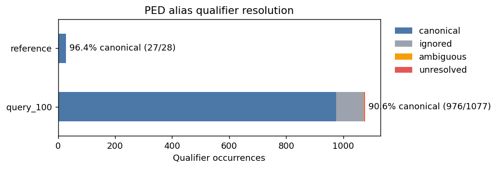
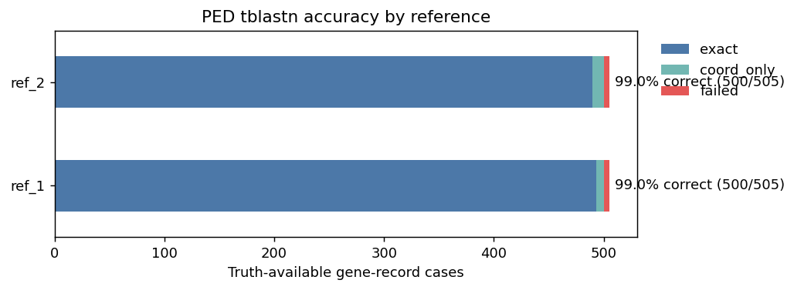
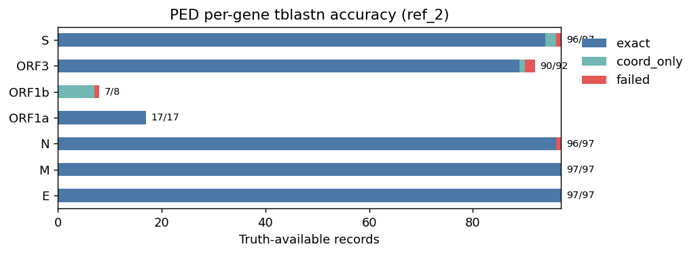

# PED Validation Report

Report này tóm tắt validation cho **Porcine epidemic diarrhea virus (PED)** dựa trên 2 notebook:

- `ped_alias_validation.ipynb`
- `ped_tblastn_validation.ipynb`

Dữ liệu dùng:

- Reference 1: `PED_ref_1.gb` (`PZ105934.1`)
- Reference 2: `PED_ref_2.gb` (`PV974486.1`)
- Query set: `PED_100seqs.gb` gồm 100 GenBank records

## 1. Mục tiêu validation

Validation PED được tách thành 2 lớp:

1. **Alias validation**: kiểm tra alias map PED có chuẩn hóa đúng tên gene từ annotation GenBank không.
2. **tblastn validation**: giả lập trường hợp query chưa có annotation, dùng tblastn lift gene từ reference sang query, rồi so với truth annotation có sẵn trong query.

Accuracy tblastn được tính theo nguyên tắc:

```text
Với từng gene, chỉ validate trên query records thật sự có gene đó trong truth.
```

Ví dụ: nếu query chỉ có `ORF1ab` gộp, record đó không được dùng làm denominator cho `ORF1a` hoặc `ORF1b`.

## 2. Reference model

Cả hai PED reference đều dùng CDS và có cùng bộ gene chính:

| Ref | Record | Genes |
|---|---|---|
| ref_1 | `PZ105934.1` | `ORF1a`, `ORF1b`, `S`, `ORF3`, `E`, `M`, `N` |
| ref_2 | `PV974486.1` | `ORF1a`, `ORF1b`, `S`, `ORF3`, `E`, `M`, `N` |

Reference không có canonical `ORF1ab`; `ORF1ab` chỉ xuất hiện trong một số query records như annotation gộp.

## 3. Alias validation

### Overall alias coverage

| Dataset | Total qualifier values | Canonical | Excluded | Unresolved | Canonical % | Actionable coverage % |
|---|---:|---:|---:|---:|---:|---:|---:|
| query_100 | 1077 | 976 | 97 | 4 | 90.62 | 99.39 |
| reference | 28 | 27 | 1 | 0 | 96.43 | 100.00 |

`Actionable coverage` loại bỏ `excluded_names` khỏi denominator. Vì các excluded names như `polyprotein`, `replicase polyprotein`, `hypothetical protein` không nên map thành canonical cụ thể.

Figure:



### Feature-level alias coverage

Sau khi apply alias ở mức feature, 100 query records có các gene sau:

| Gene | Records with gene | Feature count | Main source |
|---|---:|---:|---|
| `E` | 97 | 97 | alias |
| `M` | 97 | 97 | alias |
| `N` | 97 | 97 | alias |
| `S` | 97 | 97 | alias |
| `ORF3` | 92 | 92 | alias |
| `ORF1ab` | 85 | 88 | alias_conflict_resolved |
| `ORF1a` | 17 | 17 | alias |
| `ORF1b` | 8 | 8 | alias |

Điểm quan trọng:

- `ORF1ab` được giữ thành canonical riêng.
- Không ép `ORF1ab`, `ORF1a/1b`, `Pol1` thành `ORF1a`.
- `HNZK1` được exclude vì là strain/isolate prefix, xuất hiện ở nhiều gene khác nhau.
- `mp` được exclude vì quá ngắn và phụ thuộc context, dễ nhầm giữa ORF3 accessory protein và membrane protein.

### Names còn cần review

| Status | Raw name | Count | Nhận xét |
|---|---|---:|---|
| excluded | `mp` | 2 | Có thể là ORF3 trong dataset này, nhưng quá ngắn để auto-map an toàn |
| excluded | `replicase polyprotein` | 35 | Quá chung/gộp vùng replicase |
| excluded | `hypothetical protein` | 32 | Không đủ thông tin gene |
| excluded | `polyprotein` | 22 | Quá chung |
| excluded | `HNZK1` | 5 | Strain/isolate prefix, không phải gene |
| unresolved | misc notes | 4 | Các note mô tả frameshift/truncation, không nên auto-map |

Kết luận alias: **PED alias map hiện tại đủ tốt để dùng cho validation/pipeline**, với actionable coverage 99.39% trên query set.

## 4. tblastn validation

### Overall accuracy

Accuracy được tính trên truth-available gene-record cases.

| Ref | Record | Total | Exact | Coord correct | Coord only | Failed | Exact % | Correct % |
|---|---|---:|---:|---:|---:|---:|---:|---:|
| ref_1 | `PZ105934.1` | 505 | 493 | 500 | 7 | 5 | 97.62 | 99.01 |
| ref_2 | `PV974486.1` | 505 | 490 | 500 | 10 | 5 | 97.03 | 99.01 |

Trong đó:

- `Exact`: tên gene, start, end đều khớp truth.
- `Coord correct`: same-name truth có IoU >= 0.90.
- `Coord only`: tọa độ đúng theo IoU nhưng không exact start/end.
- `Correct % = Coord correct / Total`.

Figure:



Kết luận tổng quan: **tblastn lifting cho PED đạt 99.01% coordinate-level accuracy với cả 2 references**.

### Per-gene accuracy

#### Reference 1: `PZ105934.1`

| Gene | Total | Exact | Coord correct | Failed | Exact % | Correct % |
|---|---:|---:|---:|---:|---:|---:|
| `E` | 97 | 97 | 97 | 0 | 100.00 | 100.00 |
| `M` | 97 | 97 | 97 | 0 | 100.00 | 100.00 |
| `N` | 97 | 96 | 96 | 1 | 98.97 | 98.97 |
| `ORF1a` | 17 | 17 | 17 | 0 | 100.00 | 100.00 |
| `ORF1b` | 8 | 3 | 7 | 1 | 37.50 | 87.50 |
| `ORF3` | 92 | 89 | 90 | 2 | 96.74 | 97.83 |
| `S` | 97 | 94 | 96 | 1 | 96.91 | 98.97 |


#### Reference 2: `PV974486.1`

| Gene | Total | Exact | Coord correct | Failed | Exact % | Correct % |
|---|---:|---:|---:|---:|---:|---:|
| `E` | 97 | 97 | 97 | 0 | 100.00 | 100.00 |
| `M` | 97 | 97 | 97 | 0 | 100.00 | 100.00 |
| `N` | 97 | 96 | 96 | 1 | 98.97 | 98.97 |
| `ORF1a` | 17 | 17 | 17 | 0 | 100.00 | 100.00 |
| `ORF1b` | 8 | 0 | 7 | 1 | 0.00 | 87.50 |
| `ORF3` | 92 | 89 | 90 | 2 | 96.74 | 97.83 |
| `S` | 97 | 94 | 96 | 1 | 96.91 | 98.97 |



## 5. Main findings

### 5.1 Structural genes perform very well

Các gene structural `S`, `ORF3`, `E`, `M`, `N` có accuracy cao:

- `E`: 100% exact với cả 2 refs.
- `M`: 100% exact với cả 2 refs.
- `S`: 98.97% coordinate-correct.
- `ORF3`: 97.83% coordinate-correct.
- `N`: 98.97% coordinate-correct.

Điều này cho thấy tblastn lifting rất ổn cho phần lớn PED genes.

### 5.2 ORF1ab là annotation granularity mismatch

Truth audit:

| Truth gene | Records |
|---|---:|
| `ORF1ab` | 85 |
| `ORF1a` | 17 |
| `ORF1b` | 8 |

Nhiều PED query records annotate vùng replicase bằng `ORF1ab` gộp, trong khi reference tách thành `ORF1a` và `ORF1b`.

Vì vậy validation không ép:

```text
ORF1ab -> ORF1a
ORF1ab -> ORF1b
```

Thay vào đó, `ORF1ab` được giữ là canonical riêng trong alias map. Đây là quyết định đúng để tránh đánh giá sai tool do khác annotation convention.

### 5.3 ORF1b có pattern giống PRRSV: end đúng, start khó exact

`ORF1b` chỉ có 8 truth records, nên denominator nhỏ. Nhưng pattern rất rõ:

- `ORF1b` exact thấp.
- Hầu hết non-exact cases vẫn coordinate-correct.
- Nhiều case có `delta_end = 0`, tức end boundary đúng.
- Sai chủ yếu ở start boundary.

Ví dụ ref_1 ORF1b failures:

| Record | Delta start | Delta end | IoU | Failure |
|---|---:|---:|---:|---|
| `MF577027.1` | 135 | 0 | 0.9830 | Boundary offset |
| `PQ878525.1` | 210 | 0 | 0.9739 | Boundary offset |
| `PV974486.1` | 195 | 0 | 0.9757 | Boundary offset |
| `KX550281.1` | 12518 | 0 | 0.3847 | Wrong coords |

Ví dụ ref_2 ORF1b failures:

| Record | Delta start | Delta end | IoU | Failure |
|---|---:|---:|---:|---|
| `MF577027.1` | -74 | 0 | 0.9908 | Boundary offset |
| `PP987385.1` | -209 | 0 | 0.9740 | Boundary offset |
| `PV974486.1` | -14 | 0 | 0.9983 | Boundary offset |
| `PZ105934.1` | -209 | 0 | 0.9740 | Boundary offset |
| `KX550281.1` | 12309 | 0 | 0.3950 | Wrong coords |

Interpretation:

```text
ORF1b end boundary ổn định hơn start boundary.
Start boundary có thể chịu ảnh hưởng của ORF1a/ORF1b frameshift hoặc annotation convention.
```

Do đó phần lớn ORF1b non-exact cases nên đọc là **boundary ambiguity / convention mismatch**, không phải tool lift sai hoàn toàn.

Tuy nhiên `KX550281.1` là failure thật cần manual review: truth ORF1b start ở `293`, gần như vùng ORF1ab/full replicase, trong khi tblastn lift ORF1b start quanh `12.6-12.8k`. Đây có thể là truth annotation granularity issue hoặc record annotation bất thường.

### 5.4 Remaining failed cases

Mỗi reference có 5 failed coord cases:

| Gene | Main failed examples | Nhận xét |
|---|---|---|
| `ORF1b` | `KX550281.1` | Truth start rất sớm, giống vùng ORF1ab hơn ORF1b riêng |
| `ORF3` | `OP326239.1`, `PV533621.1` | Pred start đúng nhưng end dài hơn truth; có thể query truth bị truncated/frameshift |
| `N` | `OR085251.1` | Pred span gần như kéo từ đầu genome tới N end; nghi HSP merge/false span cần review |
| `S` | `PV536098.1` | Pred start gần đầu genome, truth start ở ~20.8k; nghi false span/HSP merge cần review |

Các failed cases còn lại nhỏ về số lượng so với tổng 505 truth-available cases.

## 6. Conclusion

PED validation cho thấy:

1. **Alias map PED hoạt động tốt**  
   Query actionable alias coverage đạt **99.39%**.

2. **tblastn lifting chính xác cao trên PED**  
   Với cả 2 references, coordinate-level accuracy đạt **99.01%**.

3. **Reference choice không tạo khác biệt lớn về overall correctness**  
   `ref_1` và `ref_2` đều đạt 500/505 coordinate-correct cases.

4. **ORF1b là gene khó exact nhất**  
   Pattern giống PRRSV: end thường đúng, start boundary lệch do frameshift/annotation convention.

5. **ORF1ab cần giữ riêng trong alias map**  
   Đây là annotation granularity mismatch phổ biến trong PED, không nên ép vào `ORF1a` hoặc `ORF1b`.

6. **Một vài failed cases cần manual review**  
   Đặc biệt `KX550281.1` ORF1b, `OR085251.1` N, `PV536098.1` S, và ORF3 truncation-like cases.

Overall, PED là một validation set tốt chứng minh ViraLift có thể xử lý virus mới bằng alias bootstrap + tblastn lifting với độ chính xác cao, đồng thời vẫn phát hiện được các case annotation convention mismatch cần review riêng.
